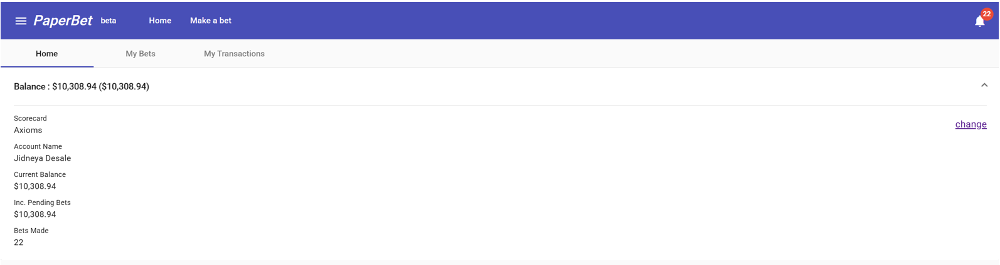
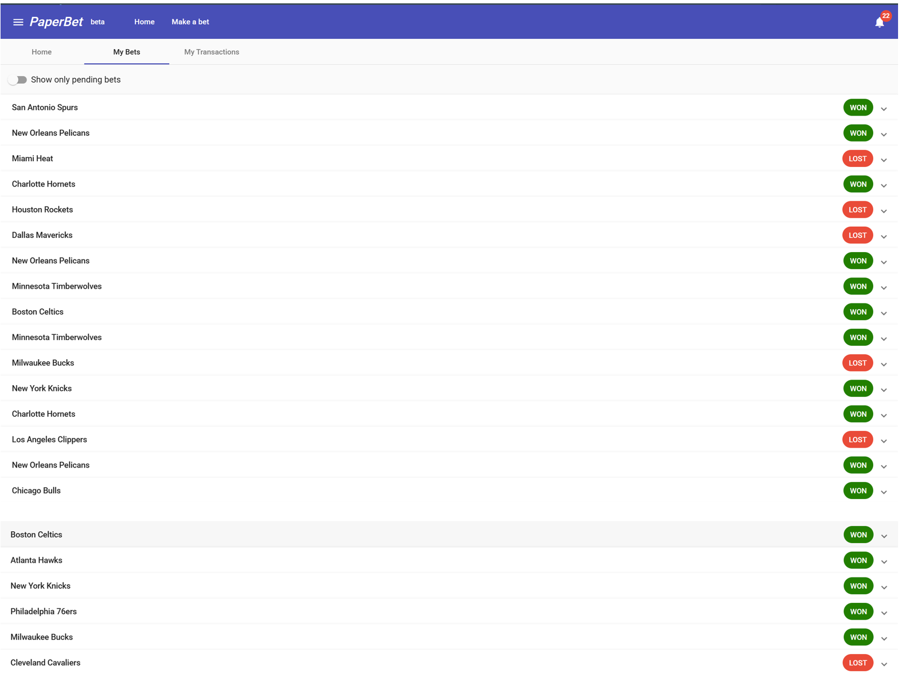

# Team Ecaw

Sports betting algorithms (NBA) for the Axioms competition.

This repository contains four base models:
- Elo model
- Linear regression model
- Monte Carlo model
- Poisson model

These are then combined into the final consensus model which weights their output probability according to
their historical win rates.

## Paper Bet Results 

The initial bankroll was $10,000, and the final bankroll after 5 days was:

The bets we made were:

And our transaction history is:

We made $308.94 dollars in profit after betting for 5 days. 
